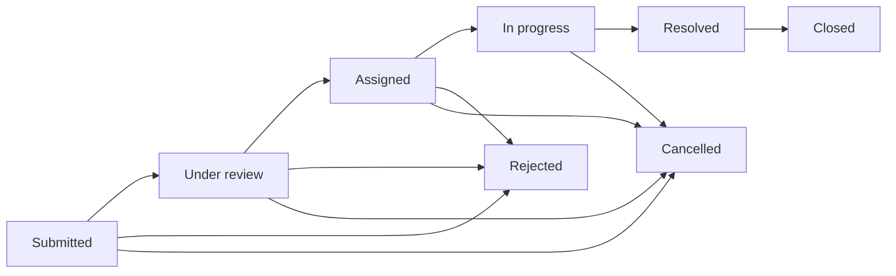

# CivicFix

The public desk in front of the city complaint API. Citizens file a record. Staff move only the complaints assigned to them. Administrators keep people, departments, categories, and the workflow in order.

This frontend is for the Programming Hero B7A7 assignment. It talks to the B7A6 API at `https://civicfix-backend-nine.vercel.app/api/v1`. Complaint totals, categories, and payments come from that API. Nothing on this site invents a live case.

## Stack

| Layer | Choice |
| --- | --- |
| App | Next.js 16, React 19, TypeScript |
| UI | Tailwind CSS 4, shadcn/ui, Lucide |
| Data | TanStack Query, Zod 4 |
| Forms | React Hook Form |
| Charts | Recharts |
| Drafts | Zustand, stored in this browser |
| Payments | Stripe Checkout, opened by the API |

Route checks in the browser are for navigation. The API still authorizes every change.

## Start

```bash
npm install
cp .env.example .env.local
npm run dev
```

Open [http://localhost:3000](http://localhost:3000).

On Windows PowerShell, copy the env file with:

```powershell
Copy-Item .env.example .env.local
```

## Environment

| Variable | Required | Purpose |
| --- | --- | --- |
| `NEXT_PUBLIC_API_URL` | Yes | Prefer `/api/v1` (same origin). Next rewrites that path to the B7A6 API. |
| `NEXT_PUBLIC_APP_URL` | Yes | This site, used for metadata |
| `NEXT_PUBLIC_STRIPE_PUBLISHABLE_KEY` | No for browse; yes for checkout | Stripe test publishable key |
| `NEXT_PUBLIC_GOOGLE_CLIENT_ID` | No | Google sign-in stays disabled until this is set |
| `CIVICFIX_API_PROXY_TARGET` | No | Server-only rewrite target. Defaults to the B7A6 Vercel API. |

Do not commit `.env.local`.

The backend must send Stripe back to this site:

- `STRIPE_SUCCESS_URL` → `/payment/success`
- `STRIPE_CANCEL_URL` → `/payment/cancel`

## The site

| Who | Where | What they can do |
| --- | --- | --- |
| Anyone | `/` `/about` `/services` `/pricing` `/contact` | Read the desk. Services lists active categories from the API. |
| Signed out | `/login` `/register` | Sign in or create a citizen account. |
| Citizen | `/dashboard` | Own complaints, a new filing, one payment lookup, notifications, profile. |
| Staff | `/staff` | Assigned queue, legal status moves, workload counted from that queue. |
| Admin | `/admin` | Users, departments, categories, every complaint, reports. |
| Either | `/unauthorized` | A session that opened the wrong desk. |
| Checkout | `/payment/success` `/payment/cancel` | Read the payment the API stored. |

A signed-out visit to a desk goes to `/login?next=…`. A signed-in visit to the wrong desk goes to `/unauthorized`.

## Demo accounts

The sign-in page can fill these seed accounts and call `POST /auth/login`. They are the backend seed, not a private password store.

| Desk | Email | Password |
| --- | --- | --- |
| Citizen | `citizen1@civicfix.local` | `Citizen@12345` |
| Staff | `staff1@civicfix.local` | `Staff@12345` |
| Admin | `admin@civicfix.local` | `Admin@12345` |

If the API answers `Database request failed`, the form shows that message. This site does not replace it with fake complaints.

## A complaint’s path

Staff cannot skip ahead. A citizen cannot close a case. The buttons on a complaint only offer the next legal status.



| Role | Allowed moves |
| --- | --- |
| Citizen | Cancel, and only from Submitted or Under review |
| Staff | In progress, or Resolved, on an assigned complaint |
| Admin | The full map, including assignment |

Citizens can edit or delete a complaint only while it is Submitted. Only an administrator assigns staff.

## Payments

1. A citizen starts checkout with `POST /payments/create-session`.
2. The API returns a Stripe URL. The browser redirects there.
3. Stripe collects the card. This site never asks for the card number.
4. The return page calls `GET /payments/{id}` and shows the stored status.

The webhook is the authority. The browser does not mark a payment paid.

Amounts are integer cents. `500` in `usd` is `5.00`.

## What this site will not invent

The API does not offer these, so the UI does not fake them.

| Missing piece | What the screen does instead |
| --- | --- |
| Payment list | Look up one payment id |
| Staff analytics feed | Count the complaints assigned to that account |
| User `isActive` filter | Activate or deactivate from the row |
| Logout endpoint | Clear the token in this browser |
| Contact inbox | Validate the note, then say it was not sent |
| Time series or department workload series | Chart the status, priority, and category counts the admin API returns |

## Scripts

```bash
npm run dev          # local site
npm run lint         # eslint
npx tsc --noEmit     # types
npm run build        # production build
npm start            # serve the build
npm test             # complaint transition rules
npm run format       # prettier
```

`npm test` runs the workflow rules in `tests/workflow.test.ts`. It does not call the live API.

## Deploy

Production site: [https://civicfix-b7a7.vercel.app](https://civicfix-b7a7.vercel.app)

```bash
npm run build
npm start
```

Or deploy with Vercel from this repo:

```bash
npx vercel --prod
```

Set these on the Vercel project (Production):

| Variable | Value |
| --- | --- |
| `NEXT_PUBLIC_API_URL` | `/api/v1` |
| `NEXT_PUBLIC_APP_URL` | `https://civicfix-b7a7.vercel.app` |
| `NEXT_PUBLIC_STRIPE_PUBLISHABLE_KEY` | your Stripe test publishable key |

The browser calls `/api/v1` on this site. Next.js rewrites those requests to `https://civicfix-backend-nine.vercel.app/api/v1`, so production does not depend on the backend CORS list.

Point the backend Stripe return URLs at that host’s `/payment/success` and `/payment/cancel`.

`https://civicfix-frontend.vercel.app` is a different Vite app. Use [https://civicfix-b7a7.vercel.app](https://civicfix-b7a7.vercel.app) for this Next.js frontend.
